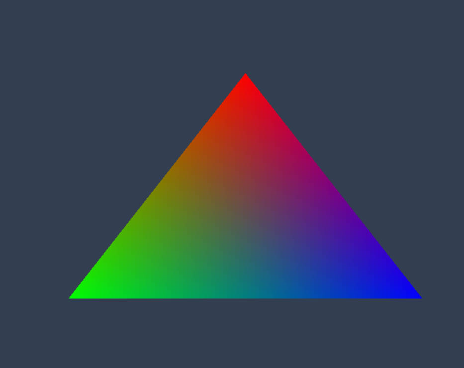

# Hello WebGPU

Aplicação de exemplo para demonstrar como funcionam shaders e WebGPU.



## Requisitos
### Necessário usar o [Chorme Canary](https://www.google.com/intl/pt-BR/chrome/canary/) com as flags de WebGPU
Habilite as flags:
1. Acesse a url [chrome://flags](chrome://flag) no Chrome
2. Procure por "WebGPU" 
3. Habilite as flags "Unsafe WebGPU" e "WebGPU Developer Features"

## Como rodar
Rodar os comandos:
```
$ npm i
$ npm run prod
$ npm run serve
```
> Por algum motivo `$ npm run watch` dá erro de build. Use `$ npm run prod` sempre.

E acessar [http://localhost:8000/](http://localhost:8000/).